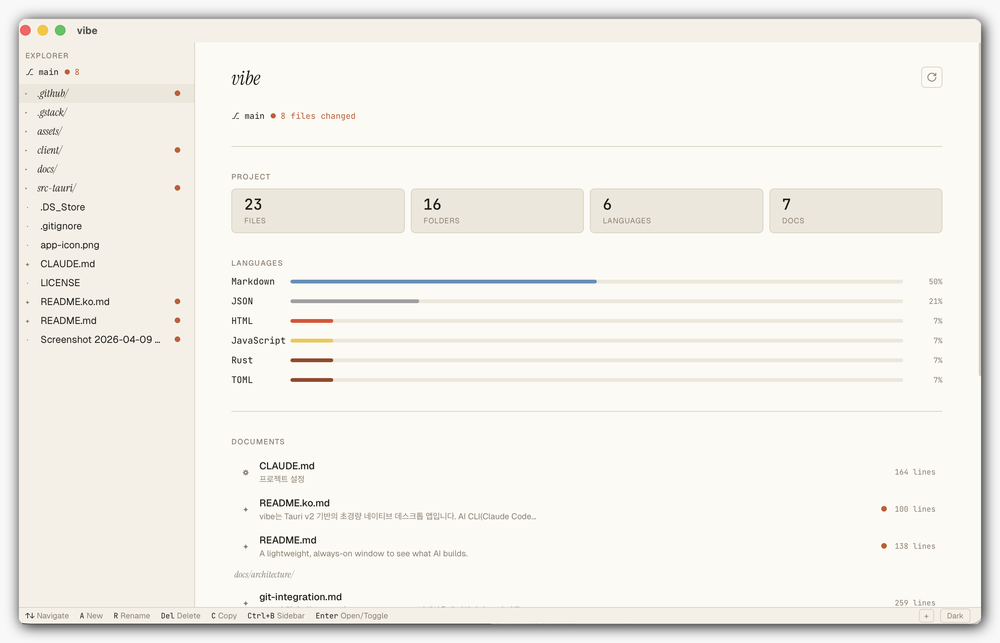
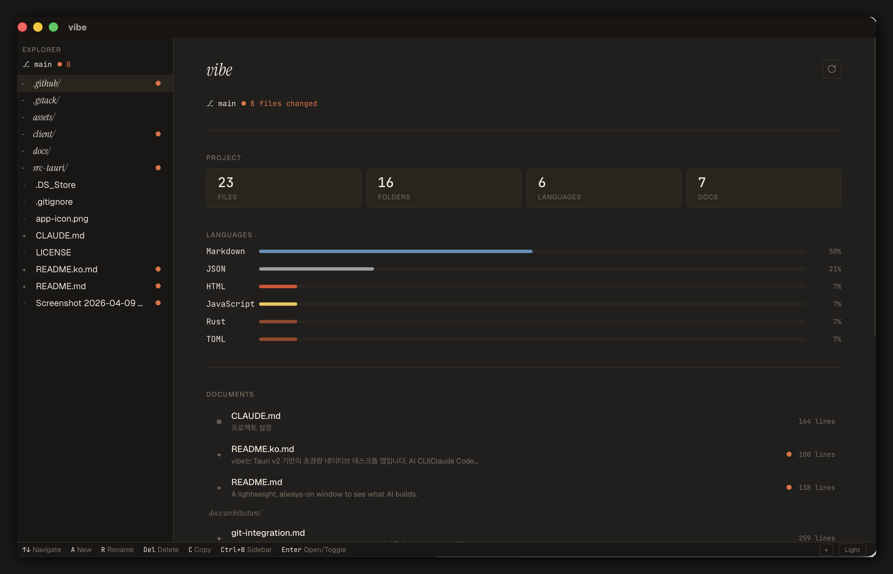

# vibe

**AI 네이티브 코딩을 위한 창.**

프로젝트 디렉토리에서 `vibe .` 한 줄이면 됩니다.

<p align="center">
  
</p>
<p align="center">
  
</p>

AI가 코드를 바꾸면, vibe에서 바로 확인하고, 직접 고쳐서 방향을 잡습니다. 디버거도 컴파일러도 없습니다. 문서를 쓰고, 읽고, 고치는 것. 그게 AI와의 협업입니다.

[English README](./README.md)

<br>

## 🚀 시작하기

[GitHub Releases](https://github.com/solpop-arch/vibe/releases)에서 최신 버전을 다운로드하세요.

- **macOS (Apple Silicon)**: `vibe_x.x.x_aarch64.dmg`
- **macOS (Intel)**: `vibe_x.x.x_x64.dmg`
- **Windows**: `vibe_x.x.x_x64-setup.exe`
- **Linux**: `vibe_x.x.x_amd64.AppImage`

macOS는 DMG를 열고 앱을 Applications 폴더로 드래그하면 됩니다.

<br>

## 이런 걸 할 수 있습니다

**파일 탐색과 편집** — 프로젝트 파일을 트리로 탐색하고, 마크다운은 렌더링해서 보여주고, 코드는 구문 강조로 보여줍니다. 바로 편집하고 저장할 수 있습니다.

**AI 변경 실시간 감지** — Claude Code 같은 AI CLI가 파일을 수정하면 자동으로 새로고침됩니다. 편집 중이면 "changed externally" 배지로 알려줍니다.

**Git diff** — 어떤 파일이 바뀌었는지 뱃지로 표시하고, 변경 내용을 인라인 또는 나란히 diff로 볼 수 있습니다.

**프로젝트 대시보드** — 프로젝트를 열면 빈 에디터 대신 대시보드가 표시됩니다. 코드베이스를 한눈에 파악하세요:

- **프로젝트 통계** — 파일 수, 폴더 수, 언어별 비율
- **문서 목록** — 루트와 `docs/` 하위 디렉토리의 마크다운 파일을 자동으로 그룹화해서 표시
- **최근 변경 파일** — 마지막으로 수정된 파일 5개. AI CLI가 방금 무엇을 건드렸는지 바로 확인 가능
- **Git 상태** — 현재 브랜치와 워킹 트리 상태

AI 세션을 마치고 프로젝트로 돌아왔을 때 특히 유용합니다. 파일 트리를 뒤지지 않아도 상황을 빠르게 파악할 수 있습니다.

**여러 프로젝트** — 프로젝트를 등록해두고 Cmd+1~9로 빠르게 전환합니다.

**다크 모드** — 따뜻한 월넛 톤의 다크 테마. Ctrl+Shift+L로 전환.

<br>

## 사용법

앱을 열면 폴더 선택 화면이 나옵니다. 터미널에서 실행할 수도 있습니다:

```bash
vibe /path/to/project    # 특정 폴더 열기
vibe .                   # 현재 폴더 열기
vibe                     # 폴더 선택 다이얼로그
```

<br>

## 단축키

| 키 | 동작 |
|---|---|
| `↑↓` | 파일 탐색 |
| `Enter` | 파일 열기 |
| `Backspace` | 상위 디렉토리 |
| `E` | 편집 모드 |
| `D` | Diff 보기 |
| `Ctrl+S` | 저장 |
| `Ctrl+B` | 사이드바 토글 |
| `Ctrl+R` | 새로고침 |
| `Ctrl+Shift+L` | 다크 모드 전환 |
| `Cmd+1-9` | 프로젝트 전환 |
| `A` / `Shift+A` | 새 파일 / 새 폴더 |
| `R` | 이름 변경 |
| `Del` | 삭제 |
| `C` | 경로 복사 |
| `Space` / `Shift+Space` | 페이지 스크롤 |
| `Esc` | 닫기 / 뒤로 |

<br>

## 소스에서 빌드하기

<details>
<summary>개발자용 — 클릭해서 펼치기</summary>

### 필수 조건

- [Rust](https://rustup.rs/) (1.70+)
- [Node.js](https://nodejs.org/) (18+)

### 빌드

```bash
git clone https://github.com/solpop-arch/vibe.git
cd vibe
cd client && npm install && cd ..
npx @tauri-apps/cli@^2 build
```

빌드된 앱은 `src-tauri/target/release/bundle/`에 생성됩니다.

### 개발 모드

```bash
npx @tauri-apps/cli@^2 dev
```

### 기술 스택

Tauri v2 · Rust · React + Vite · react-markdown · react-syntax-highlighter · notify crate · git2 (libgit2)

</details>

<br>

## 라이선스

MIT
